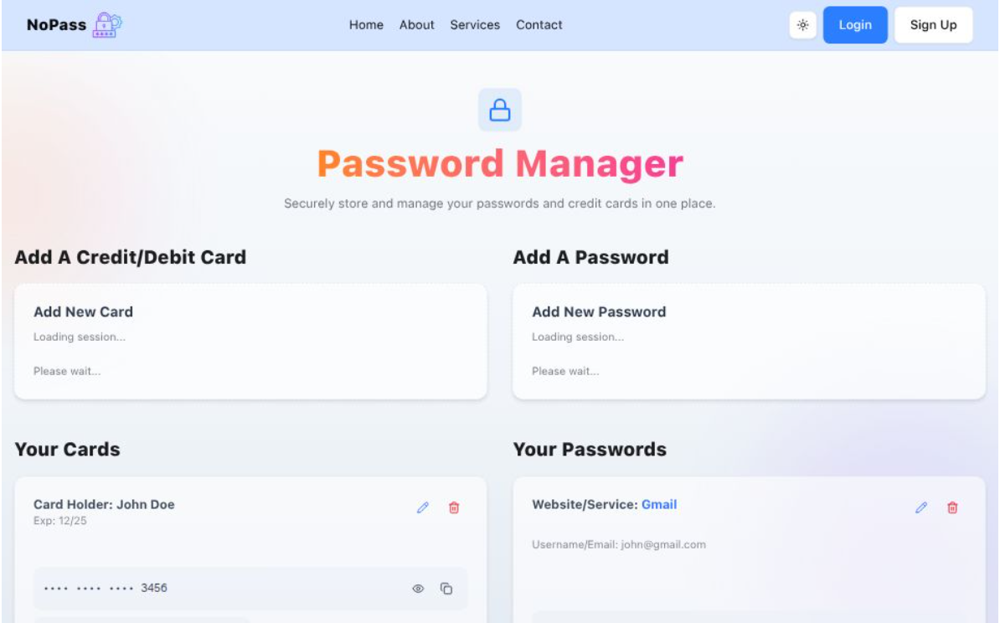
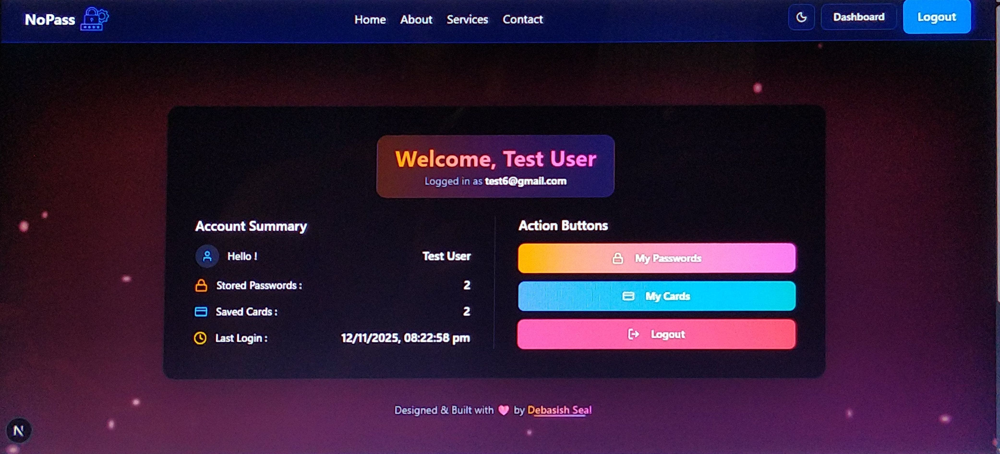
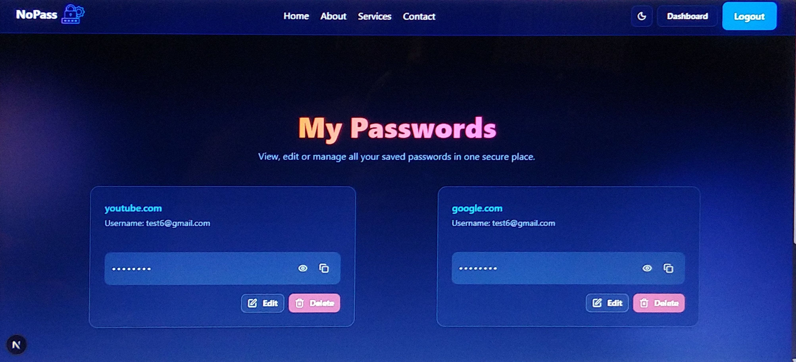
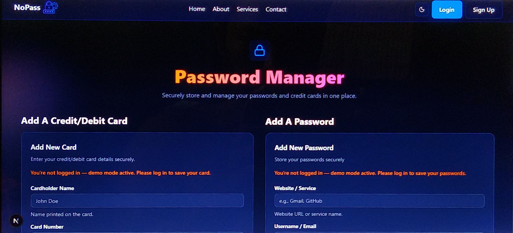

# 🔐 NoPass

**NoPass** is a secure and modern **Password & Card Manager** built with **Next.js, TypeScript, MongoDB, NextAuth, ShadCN/UI, and TailwindCSS**.  
It allows users to **store, manage, and protect passwords and credit or debit card details** — all in one encrypted, user-friendly dashboard.

---

## 📸 Screenshots

### Home Page  


### Dashboard Page  


### Passwords Page  


### Cards Page  


### Dark Mode Support  


---

## 🔗 Live Demo

👉 [NoPass](https://nopass-deba.vercel.app/)

---

## 🚀 Features

- 🔐 **Authentication System**
  - Email & Password login via NextAuth (Credentials Provider)
  - Secure session handling with JWT
  - Password reset via email with token expiry system  

- 🧠 **Password Management**
  - Securely save, view, and manage card info
  - Add, edit, and delete saved passwords
  - Auto-prefill edit mode with instant updates  

- 💳 **Credit/Debit Card Management**
  - Securely save, view, and manage card info
  - Add, edit, and delete saved cards
  - Auto-prefill edit mode with instant updates  

- 🌗 **Dark / Light Mode Support**

- 📩 **Contact Support Page**
  - Auto email response with embedded logo  
  - Authenticated user message validation  

- 🗄 **MongoDB Integration** for persistent data storage  

- ⚡ **Deployed on Vercel**

---

## 🛠 Tech Stack

- [Next.js](https://nextjs.org/) – React Framework  
- [TypeScript](https://www.typescriptlang.org/) – Type-Safe Development  
- [MongoDB](https://www.mongodb.com/) – Database  
- [NextAuth](https://next-auth.js.org/) – Authentication  
- [ShadCN/UI](https://ui.shadcn.com/) – Accessible & Reusable UI Components  
- [TailwindCSS](https://tailwindcss.com/) – Styling  
- [Zod](https://zod.dev/) – Schema Validation  
- [React Hook Form](https://react-hook-form.com/) – Form Handling  
- [Nodemailer](https://nodemailer.com/) – Email Sending  
- [Framer Motion](https://www.framer.com/motion/) – Animations  
- [Vercel](https://vercel.com/) – Deployment  

---

## ⚙️ Installation & Setup

1. **Clone the repository**
   ```bash
   git clone https://github.com/2000Deba/NoPass.git
   cd NoPass
   ```

2. **Install dependencies**
    ```bash
    npm install
    ```

3. **Setup environment variables**    
    Create a .env.local file and add:
    ```bash
    MONGODB_URI=your_mongodb_connection_string
    NEXT_PUBLIC_BASE_URL=http://localhost:3000
    ENCRYPTION_KEY=your_encryption_key
    NEXTAUTH_URL=http://localhost:3000
    NEXTAUTH_SECRET=your_secret
    GOOGLE_CLIENT_ID=your_google_client_id
    GOOGLE_CLIENT_SECRET=your_google_client_secret
    GITHUB_ID=your_github_client_id
    GITHUB_SECRET=your_github_client_secret
    EMAIL_USER=yourgmail@gmail.com
    EMAIL_PASS=xxxx xxxx xxxx xxxx   # App Password (must be entered without spaces)
    ```

    > Make sure to replace `your_mongodb_connection_string` with your actual MongoDB connection URI.

4. **Run the development server**
    ```bash
    npm run dev
    ```

The app will be available at 👉 http://localhost:3000

---

## 📦 Deployment

- Deploy easily on **Vercel** by connecting your GitHub repository.
Vercel will automatically build and deploy your project.

---

## 👨‍💻 Author

**👤 Debasish Seal**

- GitHub: [@2000Deba](https://github.com/2000Deba)
- Live Demo: [NoPass](https://nopass-deba.vercel.app/)

---

### ⭐ Don't forget to star this repo if you like it!